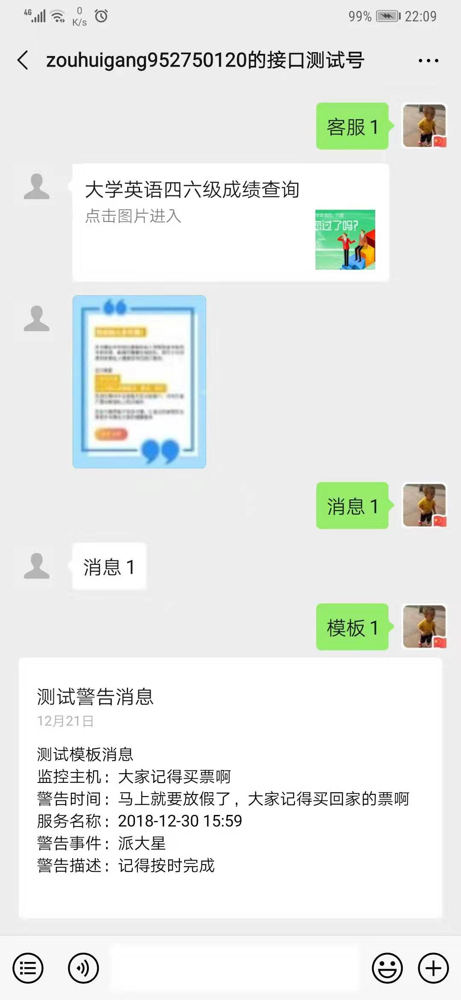

### 微信sdk

### 本地开发调试

测试账号申请:
https://mp.weixin.qq.com/debug/cgi-bin/sandboxinfo?action=showinfo&t=sandbox/index

```
  # 随便找一台服务器
  $ wget https://github.com/zouhuigang/weixinsdk/releases/download/1.0.0/weixinsdk-1.0.0-1.x86_64.rpm
  $ yum localinstall -y weixinsdk-1.0.0-1.x86_64.rpm
```
# 修改配置
  ```
  $ vi /usr/local/software/weixinsdk/build/base.env.ini
  systemctl start weixinsdk
  ````
 
 

### 效果图



### 优势

- 支持多语言调用。

- 无需管理access_token,ticket等有效期问题。

- 无需缓存access_token等。

- 调用简单方便，不需要了解服务器与微信服务器沟通的用的是xml还是json。

- 支持分布式部署。

- 支持本地缓存、redis、memcached缓存access_token等多种缓存手段。

- 快速对接现有平台，5-10分钟便可入门使用。


有了它，你可以丢弃其他语言所有的微信开发包了，简单高效，赶快下载使用吧！


### [中文文档](https://github.com/zouhuigang/weixinsdk/wiki)


